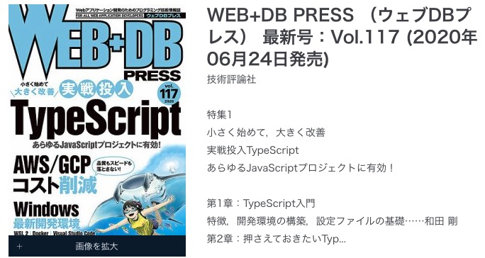

このスライドのURL
https://gitpitch.com/darakudou/pyconjp_2020

---

#### チーム開発時にやっておいたほうが良いこと
#### Yuuki Nakajima

---
#### 対象
 
 - これからチーム開発を始めようという人
 - とりあえずflake8してる人(よく分かってない) 
 - とりあえずblackしてる人(よく分かってない)

---

QUESTION

----

 - 〇〇(任意の嫌な思い出のある言語名)の仕事をもうしたくない!
 - I don't want work for ***(any program what you hate!) anymore!

---

挙手して下さい

raise your hands please ✋

---

心の中で!
only in your heart !

---

あなたがその言語を嫌いなのはひどいコードに関わってひどい目にあったせいはありませんか?

---

よく知らない人がよく分からないまま書いたコードは往々にしてひどいものになるのでは？(経験談)

---

- pythonの流行と共に起きうる懸念
  - よく知らないけどPythonでやってみようぜ！案件が出てくる
  - ひどいコードが増える(終刊実話)
  - ひどいコードを引き取ってしまう
  - Pythonの仕事はもうしたくない！

---

- バベルの塔は何故崩壊したのか？
  - 作っている人どうしで言葉が通じなくなったから  


---

- プロジェクト全体としてスタイルの一貫性を持たせることが大事!

---

- ここで話すこと
  - ソースコードを整えるための規約の紹介
  - チェックするライブラリの紹介
  - ソースを勝手に直してくれるformatterの紹介 

- ここでは話さないこと
  - 設計レベルでの一貫性や可読性の話し

---

みたいな話しをしようと思っていましたが。。。

----

だいたい雑誌に書かれてます



> 現場のPython ── システム開発も！ 機械学習も！<br>
>【第1回】開発支援ツールで安全で効率的に ……コード解析，型チェック，コードフォーマッタの実践的設定<br>

https://www.fujisan.co.jp/product/1281680264/b/1987343/

---

あと去年のPyCon JP 2019でも類似の話題があります

- Python開発を円滑に進めるためのツール設定
https://pycon.jp/2019/schedule?sessionId=151

---

### ちょっと違う部分
- formatterのautopep8/yapfの紹介
- とりあえずblackって正しいの？
- pre-commitの紹介

---

結論；
よく分からなければ pre-commitでblackを動かしてflake8でチェックすればOK

---

#### 目次
  - コード規約PEP8とは？
  - flake8でソースをチェック
  - formatterによるcheck
  - とりあえずblackは正しいのか？
    - AutoPep, yapf, blackの比較
  - pre-commitで自動適応
  - 他のライブラリ紹介
---
### お前誰よ

- Yuuki Nakajima 
- Python歴3年10ヶ月ぐらい？
- Django(DjangoRestFramework)
- AWS
- 必要なことはググりながら泥縄でなんとかしようとするタイプ
- 自分の映った写真がチェキしかないので公開できる写真ありません


---
### 罪深きコードの例

[001_spam_restaurant.py]
```
import sys
import datetime

def OrderMenu(menuName):
    return f"spam, {menuName}, spam and spam!"

if __name__ == "__main__":
    guets = "Viking"
    Input = sys.argv[1]
    orderdMenu = OrderMenu(Input);
    print(orderdMenu)
```

---

- このコードにはぱっと見で9つの罪がある
```
import sys
import datetime ← ①未使用import
　　②　空白行数
def OrderMenu(menuName): ← ③関数名、引数名
    return f"spam, {menuName}, spam and spam!"
 ④ 空白行数
if __name__ == "__main__":
    guets = "Viking" ←　⑤未使用変数
    Input = sys.argv[1] ←⑦変数名
    orderdMenu = OrderMenu(Input); ←⑧セミコロン
    print(orderdMenu)
```

⑨正しく動作する
% python src/001_spam_restaulant.py egg
spam, egg, spam and spam!

---

PEP8：コード規約の紹介

---

そもそもPEPってなに？

What is a PEP?
PEP stands for Python Enhancement Proposal. A PEP is a design document providing information to the Python community, or describing a new feature for Python or its processes or environment. The PEP should provide a concise technical specification of the feature and a rationale for the feature.

https://www.python.org/dev/peps/pep-0001/#id34

---

>What is a PEP?
PEP stands for Python Enhancement Proposal.<br>

>PEPとはPython改良提案を意味する語の頭文字を取ってPEP

>A PEP is a design document providing information to the Python community, or describing a new feature for Python or its processes or environment.<br>

>PEPは、Pythonコミュニティに情報を提供するか、Pythonまたはそのプロセスや環境の新機能を説明する設計ドキュメントです。


---

PEPの例
- PEP11
- Removing support for little used platforms

```
Name: MS-DOS, MS-Windows 3.x
Unsupported in: Python 2.0
Code removed in: Python 2.1
```
https://www.python.org/dev/peps/pep-0011/

windows3.1ではpython2.0でサポートを切られたことが分かる

---

PEP８とは
- Style Guide for Python Code 

- あくまでStyle Guideなので文法ではない
- 遵守しなくても動く

---
#### PEP8の紹介 

- 日本語で読める
  - https://pep8-ja.readthedocs.io/ja/latest/

- 一貫性にこだわりすぎるのは、狭い心の現れである
- インデントにはスペース４つを使いましょう
- 関数の名前は小文字で単語はアンダースコア(_)で繋ぐ
  - e.g goto_travel
- クラス名はCapsWordsで書く
  - e.g class Itaewon():
- 括弧の初めの直後と終わりの直前に空白を入れない

---
#### 他のガイド

  - 1行の長さは79文字
  - importの順番
    - 標準ライブラリ、サードパーティライブラリ、自分のモジュール
    - それぞれアルファベット順にする
  - コメントが2つ以上の文からなる場合、終わりのピリオドの後は、二つスペースを入れる
    - ただし、最後の文を除く。
  - 関数やクラスは2行ずつ空ける
  - メソッドは1行空ける

---

### この辺まで意識するのは辛い！

---

辛いのでライブラリにチェックしてもらいましょう

---
### flake8: コードをチェックしてくれるライブラリ
  - Flake8は以下のライブラリのラッパーツール:
    - PyFlakes
    - pycodestyle
    - Ned Batchelder's McCabe script

---

#### pyflakes

- コードチェックimportのみライブラリや未使用変数をチェック

```
imaport datetime 

guests = "Vaiking"
```
```
% pyflakes src/001_spam_restaulant.py
src/001_spam_restaulant.py:2:1 'datetime' 
imported but unused
src/001_spam_restaulant.py:5:5 local variable
 'guests' is assigned to but never used
```
---

#### pycodestyle

 - コードチェック
 - 改行とか空白の位置とかをチェック

```
% pycodestyle src/001_spam_restaulant.py
src/001_spam_restaulant.py:4:1: E302
 expected 2 blank lines, found 1
src/001_spam_restaulant.py:5:22: W291
 trailing whitespace
src/001_spam_restaulant.py:8:1: E305
 expected 2 blank lines after class or function definition, found 1
src/001_spam_restaulant.py:9:10: E221 
multiple spaces before operator
src/001_spam_restaulant.py:10:34: E703
 statement ends with a semicolon
src/001_spam_restaulant.py:11:22: W292
 no newline at end of file
```

---

#### mccabe 
  - 複雑さをチェックする

[002_complex_code.py]
```
def order(order):

    menus = ["egg and spam", "bacaon and spam", "egg bacon and spam",]
    is_egg = False
    for menu in menus:
        if "egg" in order:
            is_egg = True
        if is_egg:
            for m in menus:
                if "egg" in m:
                    return m
    return "spam, spam, spam and spam"

if __name__ == "__main__":
    input = sys.argv[1]
    orderd_menu = order(imput);
    print(orderd_menu)

```
---
### 複雑度が数字で表示される

```
% python -m mccabe --min 5 src/002_complex_code.py
2:0: 'order' 6
```

---
この3つを合体したものがflake8

---
インストール方法
```
pip install flake8
pip install pep8-nameing   # namingのチェックにはこれが必要
```

---

使い方①
```
% flake8 src/001_spam_restaulant.py 
src/001_spam_restaulant.py:2:1: F401 'datetime' imported but unused
src/001_spam_restaulant.py:4:1: E302 expected 2 blank lines, found 1
....
```

---
使い方② 複雑度チェック(defaultでは無効)

```
% flake8 --max-complexity 5  src/002_complex_code.py
src/002_complex_code.py:2:1: C901 'order' is too complex (6)
```

---
使い方③ 特定のエラーを除外する
```
% flake8 --ignore F401,E302,N802,F841,W291,E305,E221,N816,E703,W292,N803  src/001_spam_restaulant.py
```

→messageが消えた！

---
使い方④

- 設定ファイルに書き出す
- プロジェクトのトップレベルに設定を書き出す
  - setup.cfg/.flake8/tox.ini等・・・

- 参考

.flake8 を追加
```
[flake8]
ignore F401,E302,N802,F841,W291,E305,E221,N816,E703,W292,N803
exclude = .git,__pycache__,.pyc
max-complexity = 10
```

```
% flake8 src/001_spam_restaulant.py
```


---

- エラーコードの一覧<br>  
https://flake8.pycqa.org/en/latest/user/error-codes.html

- pycodestyleのもの<br>
https://pep8.readthedocs.io/en/latest/intro.html#error-codes

- pep8-naming<br>>
https://pypi.org/project/pep8-naming/

---

#### まとめ
 - pythonにはPEP8という指針がある
 - flake8というライブラリを入れるとコードチェックできる
 - pep8-namingというライブラリも一緒に入れると命名規則もチェック

---

息抜き

---

夏なので寒くなる話をします

---

本当にあった怖い話し(終刊実話)

---

なにもしてないのにコードが壊れた
 - (ciに通らなくなった)

---

[003_f_string_faild.py]
```
import sys

def order_menu(menu):
    if menu in ["egg", "bacon", "baked bean"]:
        return f"spam,{menu}, spam and spam!"
    return f"spam, spam, spam, spam, spam and spam"

if __name__ == "__main__":
    input  = sys.argv[1]
    print(order_menu(input))
```

---

おわかりでしょうか？

---

`return f"spam, spam, spam, spam, spam and spam"`

---

 - f"XX" は確かに"XX"と同じなので無意味
 - pycodestyleではこの書き方は検知されていなかった
 - pyflakesの2.2.0(Apr 10,2020)からこれをチェックするようになった 
 - その結果ある日突然ソースが落ちる自体に！！！
 - ciでは常に最新のflake8を落としていたために起きた悲劇

---

- ciで動かすときはflake8のバージョンを固定した方がいいかも？
- 急ぎでなければ直すのが正しい(あるべき論)

---

話を戻します

---
これでソースのチェックはOK

----

いちいち更新したファイル全部直すのしんどい

---

### formatterでformatしよう

---
- formaterとは
  - ソースをフォーマットしてくれるライブラリ 

---

- コードを良い感じに直してくれる
   - どこで改行すればいいか
   - うっかり入れてしまった空白とか 

---

```
count = get_spanish_inquisition_weapons_count("fear", "surprise", "ruthless efficiency", "fanatical devotion to the Pope", "nice red uniforms"):

def get_spanish_inquisition_weapons_count(*args):
    return len(*args) - 1 
```

↓　良い感じに改行してくれる(blackでの例)

```
count = get_spanish_inquisition_weapons_count(
    "fear",
    "surprise",
    "ruthless efficiency",
    "fanatical devotion to the Pope",
    "nice red uniforms",
)


def get_spanish_inquisition_weapons_count(*args):
    return len(*args) - 1
```

---

ググると出てくるライブラリ
- black: スター数 17.1K(2020/08/15)
  - https://github.com/psf/black
- yapf: スター数 10.9k(2020/08/15)
  - https://github.com/google/yapf
- autopep8: スター数 3.5k(2020/08/15)
  - https://github.com/hhatto/autopep8

---
#### autopep8

- pep8のスタイルガイドに準拠したフォーマッター
- pycodestyleを使っている
- pycodestyleにはない問題の修正も行っている
- aggressiveレベルを指定してそれによって修正内容が異なる
- Python2.7/Python3.4から使える
- 未使用importや変数は消してくれない 

---

使い方①

`pip install autopep8`

- --inplaceオプションをつけてファイルを修正する
- 基本は空白に関する修正のみ
`autopep8 --in-place src/004_autopep_sample.py`
----

使い方②

--agressiveオプションをつけると修正内容が増える

`autopep8 --in-place --agressive src/004_
autopep_sample.py`

--agressiveオプションを2つつけると修正内容がもっと増える

`autopep8 --in-place --agressive --agressive
 src/004_autopep_sample.py`

---

#### エラーの一覧はこちらに記載

https://github.com/hhatto/autopep8#features

---

### yapf

- google製のFormatter
- PEP8に準拠したコードが正しいとは限らない
- end all holy wars about formatting
  - フォーマットに関する全ての聖戦を終わらせる
- やたら細かく設定できる
- Python2.7/Python3.6〜
- 未使用変数やimportは消してくれない

---

### 設定方法

```
[yapf]
based_on_style = pep8/google/yapf/facebook
spaces_before_comment = 4
split_before_logical_operator = true
```

- 58項目ぐらい設定できる
  - インデントの数
  - 文末のセミコロンを許可するか
  -  等々・・・

----

#### 使い方

`yapf --i --style='{DISABLE_ENDING_COMMA_HEURISTIC=True}' src/005_yapf_sample.py`

```
one = "two";
```
↓↓↓
```
one = "two"
```
---

### black

- まだベータ版とは書いてあるが大きな変更は予定されていないとのこと
- 妥協のないpythonコードフォーマッター
- yapfのように細かい設定が出来ない
- install出来るのはPython3.6以降の環境のみ
- 指定すれば2系のコードもチェックできるらしい(未確認）
- 未使用変数やimportは消してくれない

---
#### 使い方①

`pip install black`

`black {source_file_or_directory}`

---
### 使い方②

- ファイルの除外
- １行の最大値の設定
- pythonのバージョン指定

---

- blackをかけてもflake8を通らないチェックがある
- flake8からエラーを除外すればOK(blackの公式より))

```
[flake8]
max-line-length = 90 
ignore = E203, E501, W503
```


---

005_conflict_black_flake8
```
# E203 Whitespace before ':'
name_lists = ["tarou", "hanako", "ichitarou", ""]
a = name_lists[1 + 1 :]

# E501 line too long (XX > 79 characters)
name = "jyugemujyugemu gokounosurikire kaijyarisuigyono suigyoumatu unnkoumatu."

# W503 line break before binary operator
income = (3
          + 4)
```

----

まとめ
- formatterには有名どことで３つある
 - black
    - フォーマットの設定が指定できないようにすることでかえって細かい論争を封じ込める
 - yapf
    − 細かい設定を充実させることで、プロジェクト毎にどんな設定でも作れるようにする
 - autopep8
    - pep8に従うことを是としたライブラリ
      - 設定は細かく行うことが出来る

---
未使用importや未使用変数の消し方

 - autflakeをかける

`pip install autflake` 

 `autoflake --in-place --remove-all-unused-imports --remove-unused-variables`

---


### コラム

- 1行の長さはなにが正しいのだろうか?
  - PEP8: 79文字 
  - black: 88文字(defautl)
  - yapf: 80文(defautl)
  - autopep8: 79文字

---

- 個人的には大きいディスプレイで見るなら90文字以上あってもいいが
- ノートブックだけだと80文字ぐらいが見やすいかも
- やっぱり79文字は少ない気がする

---

本編に戻ります

---
pre-commitでformatterを自動的に動かそう

 ---

formatterが決まったことで、細かいルールも決まりました

 ---

でも、選んだファイルをformatterにかけ忘れてcommit & pushしてしまったら？

---


---

うっかりミスを防ぐためにはpre-commitを採用してみましょう

---

pre-commitとは・・・・
 - gitフックスクリプト
 - コミット毎にフックを実行
   - セミコロンの欠落や末尾の空白などのコードの問題を自動的に指摘
 - レビューアーは変更内容に集中してレビュー出来る 

---
使い方
`pip install pre-commit`

- .pre-commit-config.yamlを用意してその中に実行したい内容を書く

```
repos:
-   repo: https://github.com/psf/black
    rev: statble 
    hooks:
    -   id: black
```

---


他にも設定した方が良い物

- mypy
  - 引数などの型チェックを行ってくれる
- isort
  - import順を直してくれるもの

---

まとめ
- pre-commitでコミットタイミングでblacｋやその他のツールを動かせる
- 設定しておくと忘れないのでやっておきましょう
- ciとかでもいいとは思う

---

- おまけ
既存のプロジェクトにblackをかけたらどうなっちゃうの？

- 業務で使っている某スマホアプリのバックエンド（Django)
 - 1247ファイル
 - 30Apps
 - flake8によるチェックは常に実施 

→何も考えずに手元でblack

---

```
All done! ✨ 🍰 ✨
429 files reformatted, 786 files left unchanged.
```

- 差分のほとんどはmigratefileでシングルクォートをダブルクォートへの変換部分
- flake8でコードの一貫性が保たれたコードならformatterを導入してもいけそう

---

早い段階からflake8&formatter&pre-commitでPythonコードの保守の安定化を進めましょう！

---

## Excelsior！

-- 常に向上を！

---

### the end

---

- QA
