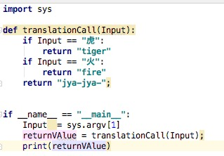

#### チーム開発時にやっておいたほうが良いこと
#### 〜how to raise a Boring source code〜
#### Yuuki Nakajima

---
#### 問題意識
- プログラミングはどうしても個人の"癖"がでてしまう。
- 全体として書き方が統一がされていないことがある。

- そういった部分をレビューで指摘するのはしんどい
- pythonの規約に対する警告などはgitの差分とかでは見過ごしてしまう
   - classとclassの間が2行空いてるかとか見ない・・・
---
大体自分程度が悩むことは先人の誰かが悩んでいて解決案もある!


---
という話しを今回はしようと思っていました


---

が・・・・！！！

----
### 話そうと思ってたことは大体書かれてしまった！ 


> 現場のPython ── システム開発も！ 機械学習も！
【第1回】開発支援ツールで安全で効率的に ……コード解析，型チェック，コードフォーマッタの実践的設定
#### TODO:URLは変わる
https://www.fujisan.co.jp/product/1281680264/new/

---

CfPを出した後にこれが出てきたのでとても辛い

---
気を取り直してちょっと補足的な内容にしようと思います

---
#### 目次

- 冴えないコードの防ぎ方
  - 罪深きソースコードの例
  - PEP8とは
  - flake8でコードチェック
- 冴えたコードの作り方
  - formatterによるチェック 

---
[001_ GuiltyCode.py]

```
import sys
import this

def translationCall(Input):
    aaaaaaa = Input
    if Input == "虎":
        return "tiger" 
    if Input == "火":
        return "fire"
    return "jya-jya-";


if __name__ == "__main__":
    Input  = sys.argv[1] 
    returnVAlue = translationCall(Input);
    print(returnVAlue)
```

正しく動作する

```
% python code/001_\ GuiltyCode.py 虎
tiger
```
---

そこでPEP8

---
PEP8ってなに？

---
という前に先ほどのコードをPyCharmで開いてみましょう




---


そう言えば警告ってどんなルールに基づいて表示されているの？

---
そのルールがPEP8です(キリッ)

---

さらに遡ってPEPってなに？

What is a PEP?
PEP stands for Python Enhancement Proposal. A PEP is a design document providing information to the Python community, or describing a new feature for Python or its processes or environment. The PEP should provide a concise technical specification of the feature and a rationale for the feature.

https://www.python.org/dev/peps/pep-0001/#id34

---

>What is a PEP?
PEP stands for Python Enhancement Proposal.<br>

PEPとはPython改良提案を意味する語の頭文字を取ってPEP


>A PEP is a design document providing information to the Python community, or describing a new feature for Python or its processes or environment.<br>

PEPは、Pythonコミュニティに情報を提供するか、Pythonまたはそのプロセスや環境の新機能を説明する設計ドキュメントです。

---

PEPの例
PEP11
- Removing support for little used platforms

```
Name: MS-DOS, MS-Windows 3.x
Unsupported in: Python 2.0
Code removed in: Python 2.1
```
https://www.python.org/dev/peps/pep-0011/

windows3.1ではpython2.0でサポートを切られたことが分かる

---
PEP８とは

- PEPで提案されたコード規約

---
#### いくつか紹介
- 一貫性にこだわりすぎるのは、狭い心の現れである
- 関数の名前は小文字で単語はアンスコ(_)で繋ぐ
- goto_travel
- クラス名はCapsWordsで書く
  - e.g class Itaewon():
- 関数やクラスは2行ずつ空ける
- メソッドは1行空ける

---
 このくらいなら意識できそう

---
#### 他のルール
  - 1行の長さは79文字
  - importの順番
    - 標準ライブラリ
      - Pythonが持ってるライブラリ,datetimeとか)
    - サードパーティライブラリ
      - pip installしたライブラリ,requestsとか)
    - 自分のライブラリ
      - from util import my_function
    -  それぞれアルファベット順にする

---

- 正直、これを意識して書くのって辛いよね

---

- 機械にチェックしてもらいましょう

---

##### 測りたいもの
  - 未使用変数
  - PEP８とのチェック
  - コードの複雑さ  

---

pyflakes

- コードチェックimportのみライブラリや未使用変数をチェック

```
% pyflakes .
./001_ GuiltyCode.py:2:1 'this' imported but unused
./001_ GuiltyCode.py:5:5 local variable 'aaaaaaa' is assigned to but never used
```

---
pycodestyle
 - コードチェック
 - 改行とか空白の位置とかをチェック

```
pycodestyle 001_\ GuiltyCode.py 
001_ GuiltyCode.py:3:1: E302 expected 2 blank lines, found 1
001_ GuiltyCode.py:5:23: W291 trailing whitespace
001_ GuiltyCode.py:8:22: E703 statement ends with a semicolon
001_ GuiltyCode.py:12:10: E221 multiple spaces before operator
001_ GuiltyCode.py:12:25: W291 trailing whitespace
001_ GuiltyCode.py:13:41: E703 statement ends with a semicolon
001_ GuiltyCode.py:14:23: W292 no newline at end of file
```
---
mccabe 
  - 複雑さをチェックする

[002_complex_code.py]
```
import sys


def translation(input):
    ja_calls = ["虎", "火", "人造",  "繊維", "海女", "振動", "化繊"]
    en_calls = ["tiger", "fire", "cyber", "fiber", "diver", "viber"]
    i = 0
    j = 0
    is_unmatch = False
    for c in ja_calls:
        if c != input:
            is_unmatch = True
        if c == input:
            is_unmatch = False
        if is_unmatch:
            i = i + 1
            continue
        for cc in en_calls:
            if j != i:
                j += 1
                continue
            return_value = en_calls[j]

    if return_value:
        return return_value
    else:
        return_value = "jya-jya-"
    return return_value

if __name__ == "__main__":
    input = sys.argv[1]
    output = translation(input)
    print(output)
```

---

- 複雑度が数字で表示される
```
% python -m mccabe --min 5 002_complex_code.py
4:0: 'translation' 8
```

---
この3つを合体したものがflake8

---
使い方
```
flake8 .
./001_ GuiltyCode.py:2:1: F401 'this' imported but unused
./001_ GuiltyCode.py:4:1: E302 expected 2 blank lines, found 1
....
```

---

複雑度もチェックする(defaultでは無効)
```
flake8 --max-complexity 5 002_complex_code.py 
002_complex_code.py:4:1: C901 'translation' is too complex (8)
```

---

まとめ
 - pythonにはPEP8という指針がある
 - 規約を守らせるためにflake8というライブラリを入れるとコードチェックできる
---
息抜き

---
flake8は進化する！

---

### flake8を最新化したら突然エラーになることがある！(週刊実話)

---

[003_f_string_faild.py]
```
def translation(input):
    if input == "虎":
        return "tiger"
    return "jya-jya-"


if __name__ == "__main__":
    output = translation(f"虎")
    print(output)
```

`output = translation(f"虎")` 

f"虎" は確かに"虎"と同じなので無意味なのだが今まで許されていたのが
pyflakesの2.2.0からこのチェックが加わったことで既存のコードに
上記のような書き方が残っていると軒並みエラーに・・・・

---
ということで

---
flake8 で常にチェックしましょう！

---

カタカタカタカタカタカタカタカタカタッターンッ

flake8 .
error XXXX
error XXXXX

----

カタカタカタカタカタカタカタカタカタッターンッ

flake8 .
error XXXX

----

:sub:

---

誰か代わりに直してよ

---
formatterでformatしよう
---
ググると出てくるライブラリ
- black: スター数 17.1K(2020/08/15)
  - https://github.com/psf/black
- yapf: スター数 10.9k(2020/08/15)
  - https://github.com/google/yapf
- autopep8: スター数 3.5k(2020/08/15)
  - https://github.com/hhatto/autopep8

---

だいたいblackでOKという記事がでてくる

---

blackってどんなライブラリ？特徴は？歴史は？他との比較は？彼氏は？調べてみました！

---

## black

- 今のバージョンは19.10b0
- まだベータ版とは書いてあるが大きな変更は予定されていない
- 妥協のないpythonコードフォーマッター
- 手動フォーマットを全てblackに譲ることになる
- フォーマットで悩むことがなくなる

---

blackを通してもflake8は通らないものがある！

---

004_conflict_black_flake8
```
# E203 Whitespace before ':'
name_lists = ["tarou", "hanako", "ichitarou", ""]
a = name_lists[1 + 1 :]

# E501 line too long (XX > 79 characters)
name = "jyugemujyugemu gokounosurikire kaijyarisuigyono suigyoumatu unnkoumatu."

# W503 line break before binary operator
income = (3
          + 4)
```

---

### 対策

とりあえずflake8からエラーを除外すればOK(公式に書かれた記載を転載)
```
[flake8]
max-line-length = 80
...
select = C,E,F,W,B,B950
ignore = E203, E501, W503
```

---

### yapf

- google製のフォーマッター
- PEP8に準拠したコードが正しいとは限らない
- end all holy wars about formatting
- 日本語訳:フォーマットに関する全ての聖戦を終わらせる
- 
